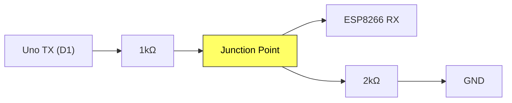
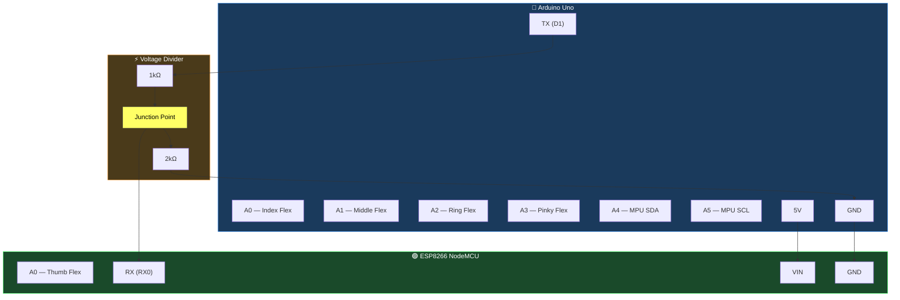
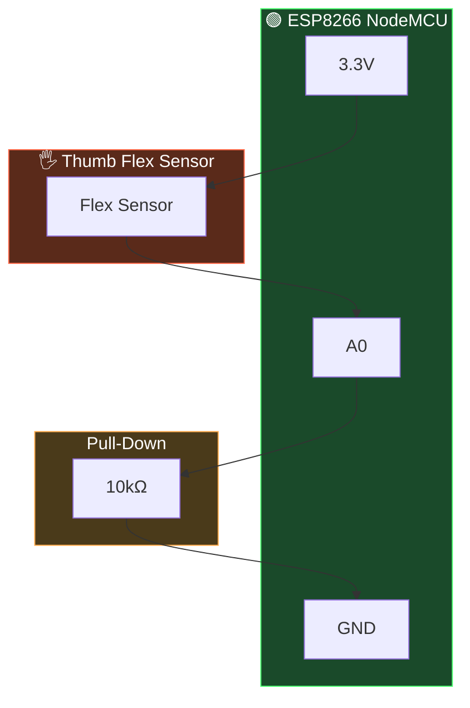

# IoT Connection Guide: Steps 1 & 2

---

## Step 1: Voltage Divider (5V → 3.3V)

The Uno TX is 5V, ESP8266 RX is 3.3V. A voltage divider steps it down safely.

**3 things connect at the Junction Point (same breadboard hole):**
1. Output of 1kΩ resistor (from Uno TX)
2. Wire to ESP8266 RX
3. Top of 2kΩ resistor (bottom goes to GND)

---

## Step 2: Complete Logical Diagramz

### Wire Summary

| Wire | From | To | Purpose |
|------|------|----|---------|
| 🟠 | Uno TX (D1) | → 1kΩ → Junction → ESP RX | Data through divider |
| 🟠 | Junction | → 2kΩ → GND | Pulls voltage to 3.3V |
| 🔴 | Uno 5V | → ESP VIN | Power |
| ⚫ | Uno GND | → ESP GND | Common ground |

> [!CAUTION]
> Do NOT connect ESP VIN to Uno 3.3V. The ESP needs 5V on VIN and draws up to 400mA (Uno 3.3V only gives 150mA).

---

## Step 3: Thumb Flex Sensor → ESP8266 A0

### Wiring Steps:
1. **Flex sensor leg 1** → ESP8266 **3.3V** (⚠️ NOT 5V!)
2. **Flex sensor leg 2** → ESP8266 **A0**
3. **10kΩ resistor** between ESP8266 **A0** and **GND**

---

## Checklist
- [ ] 1kΩ between Uno TX and Junction Point
- [ ] 2kΩ between Junction Point and GND
- [ ] Wire from Junction Point to ESP RX
- [ ] Uno GND → ESP GND
- [ ] Uno 5V → ESP VIN
- [ ] Thumb flex sensor between ESP 3.3V and ESP A0
- [ ] 10kΩ pull-down between ESP A0 and GND
